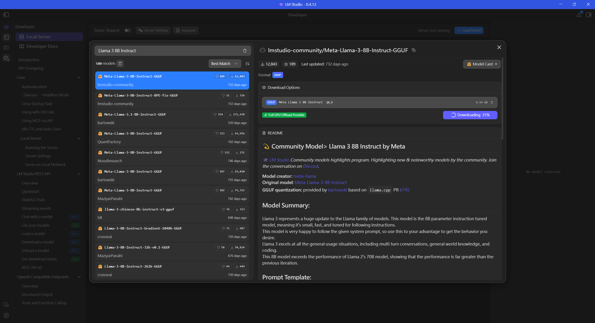

# Llama 3 8B Instruct (Q8_0 版本) 模型詳細資訊說明書

> [!NOTE]
> **參考圖 (系統下載畫面)**
> 

---


## 💫 模型概覽 (Community Model)
*   **名稱**: Llama 3 8B Instruct by Meta
*   **亮點**: LM Studio 社群精選模型，展現最新且值得注目的技術成果。

---

## 🛠️ 開發資訊
*   **模型創建者**: meta-llama
*   **原始模型**: Meta-Llama-3-8B-Instruct
*   **量化處理 (GGUF)**: 由 **bartowski** 提供 (基於 llama.cpp PR 6745)

---

## 📝 模型摘要 (Model Summary)
Llama 3 是 Llama 系列模型的重大更新。本模型為 **8B (80億) 參數**的指令微調版本。

*   **特性**: 體積小、速度快，且專為「遵循指令」而設計。
*   **系統提示詞**: 該模型非常善於遵循給定的系統提示詞 (System Prompt)，請善用此特性來獲得你想要的行為。
*   **適用場景**: 擅長所有通用情境，包括多輪對話、一般世界知識以及程式碼撰寫。
*   **性能突破**: 此 8B 模型的表現**超越了上一代 Llama 2 的 70B 模型**，顯示出效能遠勝於以往版本。

---

## 💬 提示詞範本 (Prompt Template)
> **建議設定**: 請在 LM Studio 中選擇 **'Llama 3'** 預設值 (Preset)。

**底層運作格式如下:**
```text
<|begin_of_text|><|start_header_id|>system<|end_header_id|>

{system_prompt}<|eot_id|><|start_header_id|>user<|end_header_id|>

{prompt}<|eot_id|><|start_header_id|>assistant<|end_header_id|>
```

---

## 🚀 使用案例與範例
Llama 3 幾乎能處理任何任務。你可以嘗試用於對話、程式碼編寫以及各種通用諮詢。

*   **創意對話**: 例如設定系統提示詞為：「你是一個總是使用海盜口吻回答的海盜聊天機器人！」
*   **通用知識**: 涵蓋各類知識問答。
*   **程式碼撰寫**: 具備強大的編程輔助能力。

---

## ⚙️ 技術細節 (Technical Details)
*   **訓練量**: 接受了來自廣泛主題與語言的超過 **15T tokens** 訓練，程式碼量比 Llama 2 多出 4 倍。
*   **記憶體優化**: 具備 **Grouped Attention Query (GQA)** 技術，使記憶體使用量在大脈絡下能良好擴展。
*   **指令微調**: 結合了 SFT、拒絕採樣、PPO 與 DPO 等多種強化學習技術。

---

## 🙏 特別鳴謝
*   感謝 Georgi Gerganov 與 llama.cpp 團隊讓這一切成為可能。
*   感謝 Kalomaze 提供的數據集，用於計算量化矩陣 (imatrix)，提升了整體品質。

---

## ⚠️ 免責聲明 (Disclaimers)
LM Studio 並非社群模型計畫中任何模型的創建者、發起者或所有者。所有社群模型均由第三方創建與提供。LM Studio 不代表或保證任何社群模型的完整性、真實性、準確性或可靠性。
您理解社群模型可能會產生具有攻擊性、有害、不準確或其他不當或欺騙性的內容。每個社群模型由其發起人或實體承擔全部責任。您將對因使用或讀取社群模型而導致的任何損害承擔全部責任。
